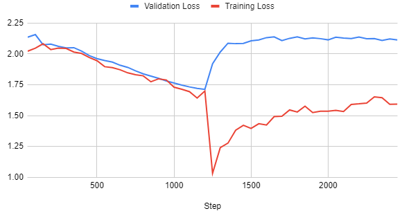

# 自然语言处理: 第二十七章LLM训练超参数

## 前言:

LLM微调的超参大致有如下内容,在本文中，我们针对这些参数进行解释

```

training_arguments = TrainingArguments(
        output_dir="./results",
        per_device_train_batch_size=4,
        per_device_eval_batch_size=4,
        gradient_accumulation_steps=2,
        optim="adamw_8bit",
        logging_steps=50,
        learning_rate=1e-4,
        evaluation_strategy="steps",
        do_eval=True,
        eval_steps=50,
        save_steps=100,
        fp16= not torch.cuda.is_bf16_supported(),
        bf16= torch.cuda.is_bf16_supported(),
        num_train_epochs=3,
        weight_decay=0.0,
        warmup_ratio=0.1,
        lr_scheduler_type="linear",
        gradient_checkpointing=True,
	)
```

<br />

<br />

<br />

## 一、批大小batch_size

我们来讨论批大小的设置。在模型训练过程中，批大小指的是每一次训练步骤中所用的样本数目。我们会将数据集分割成多个批次，然后在每完成一个批次的处理——亦即 完成一步训练之后——更新一次模型的权重。如何选择合适的批大小是模型训练过程中的一个关键考量，它直接关系到模型训练的收敛速度以及训练质量。一般来说，较小的批大小能够带来规则化的效果，降低模型对新数据的泛化误差，这样可以使得模型更加稳定。但这同时可能会减慢训练速度，并增加模型陷入局部最小 值的风险。而较大的批大小能够利用硬件优化——比如GPU的并行处理能力——来加快训 练的速度，但这样做需要消耗更多的内存，并且可能会使得梯度的估算不够精确。这里，“梯度”可以被视作一个指示箭头，它指向模型错误增长最快的方向。在模型训练的过程中，我们的目标是尽量减少错误。为了做到这一点，我们需要检查梯度来确 定哪个方向是我们不希望模型去的，然后调整模型使其朝着相反方向移动，以此减少错误。

`per_device_train_batch_size=4,         `

`per_device_eval_batch_size=4,`

实际操作时，你可以不断增加批大小，直至出现GPU内存溢出的错误，这表示GPU已 无法处理更大的批次。这样，我们就可以找到适合我们硬件的最大批大小。在TrainingArguments中，你可以使用以下参数设置批大小：

对于批量大小为 1 的情况：


对于批量大小为 2 的情况：


对于批量大小为 4 的情况：


对于批量大小为 8 的情况：


比较：


批量大小对模型训练质量和效率有显著影响。较大的批量可以提升模型性能并加快训练过程，但同时也要考虑到整体训练时间，包括执行验证步骤所需的额外时间。使用小批量时，应相应减少验证步骤的频率，以减少总训练时间。

实验表明，即使在批量大小为32的情况下，也能获得较好的损失结果。但是，这会增加内存的使用量，在一些情况下，如16GB内存的GPU上，如果不采用如梯度累积等技术，实现这样的批量大小是不现实的。因此，而不是单纯追求更大的批量，应综合考虑硬件限制并通过实验确定最佳的批量大小。这种方法保证了在可用资源范围内，模型训练既高效又实用。


<br />


<br />


<br />


## 二、最大Sequence Length、Padding、Truncating

在批处理中，需要对训练样本进行填充，以确保每一批数据中所有样本的形状或大小一致，这是并行处理数据的机器学习模型的基本要求。特别是在执行序列任务，如语言生成时，这种数据的统一性变得尤为重要。

在准备数据批次时，需要对较短的序列进行填充，增加一些无关紧要的值，以确保它们的长度与批次中最长序列相匹配。这种填充可以是在序列的前端（左填充），或者是尾端（右填充），有时还可能两端同时进行，这取决于具体的模型设计和任务需求。需要注意的是，并不是所有的技术都能适应任意一端的填充方式。例如，在使用**FlashAttention技术时，必须进行左填充。**

为了更好地控制批次大小，建议设定一个最长序列限制。例如，我们如果将这个最大长度设置为1,024个令牌，那么批次中的每个样本都会被处理到恰好有1,024个令牌。如果某个样本原本只有512个令牌，那么就会追加512个填充令牌。相反，如果某个样本的令牌数超过了1,024个，那么超出的部分就会被截断。通过这种方式，我们不仅能保证处理过程的一致性，也有助于优化内存的使用，从而提升训练的效率。

看一个例子。我们想将这 2 个句子放入一批中：

```
prompt1 = "You are not a chatbot."
prompt2 = "You are not."

prompt_test1 = [prompt1, prompt1]
prompt_test2 = [prompt1, prompt2]
```

我做了两批提示。第一个包含两次相同的序列，因此两个序列具有相同的长度。

如果我们使用 Llama 2 的分词器来分词prompt_test1

```
input = tokenizer(prompt_test1, return_tensors="pt");
print(input)
```

它产生输入 ID（令牌的 ID）和注意力掩码的张量：It yields tensors of input IDs (the IDs of the tokens) and attention mask:

```
{
    'input_ids': tensor([[    1,   887,   526,   451,   263, 13563,  7451, 29889],
        [    1,   887,   526,   451,   263, 13563,  7451, 29889]]),
    'attention_mask': tensor([[1, 1, 1, 1, 1, 1, 1, 1],
        [1, 1, 1, 1, 1, 1, 1, 1]])
}
```

但是，如果尝试标记prompt_test2：

```
input = tokenizer(prompt_test2, return_tensors="pt");
print(input)
```

它会产生这个错误：*ValueError: Unable to create tensor, you should probably activate truncation and/or padding with 'padding=True' and 'truncation=True' to have batched tensors with the same length. Perhaps your features (`input_ids` in this case) have excessive nesting (inputs type `list` where type `int` is expected)*

这个错误信息明确指出了我们需要对样本进行填充和截断。鉴于我们的样本长度较短，我们把分词器的最大长度设定为20。我选择了向左填充的策略，并且决定用“UNK”（未知）令牌作为填充令牌。通过这种设置，可以确保所有的输入长度一致，无论是在训练还是在模型推断过程中，使得模型处理过程更加高效。同时，使用UNK令牌作为填充，有助于模型在处理未知或不常见的输入时更为鲁棒。

```
tokenizer.padding_side = "left"
tokenizer.pad_token = tokenizer.unk_token
input = tokenizer(prompts, padding='max_length', max_length=20, return_tensors="pt");
print(input)
```

它产生：

```
{
    'input_ids': tensor([
        [    0,     0,     0,     0,     0,     0,     0,     0,     0,     0,
             0,     0,     1,   887,   526,   451,   263, 13563,  7451, 29889],
        [    0,     0,     0,     0,     0,     0,     0,     0,     0,     0,
             0,     0,     1,   887,   526,   451,   263, 13563,  7451, 29889],
        [    0,     0,     0,     0,     0,     0,     0,     0,     0,     0,
             0,     0,     0,     0,     0,     1,   887,   526,   451, 29889]]), 
    'attention_mask': tensor([
        [0, 0, 0, 0, 0, 0, 0, 0, 0, 0, 0, 0, 1, 1, 1, 1, 1, 1, 1, 1],
        [0, 0, 0, 0, 0, 0, 0, 0, 0, 0, 0, 0, 1, 1, 1, 1, 1, 1, 1, 1],
        [0, 0, 0, 0, 0, 0, 0, 0, 0, 0, 0, 0, 0, 0, 0, 1, 1, 1, 1, 1]])
}
```

现在序列的开头（左侧）出现了许多"0"，这代表着填充令牌的ID。在训练时，以确保这些填充标记不会干扰模型的学习，它们在注意力掩码中被标记为"0"，表示将被忽略。可以看到，最大序列长度对批次形状有决定性影响。例如，如果选择的批量大小是12，而最大序列长度是1,024，那么批次的形状就会是12*1,024，包含总共12,288个令牌。若最大序列长度设置为512，则批次大小会减半。

理想情况下，**最大长度应设为与训练样例中最长序列的长度相匹配。**如果GPU内存有限，这个长度也可以适当减少。通常，除了用于RAG应用和摘要任务外，超过4,096的最大长度并不常见；对于大多数的语言生成任务，最小推荐长度是512。这样的设定有助于在确保模型效能的同时，避免不必要的内存消耗。


<br />


<br />


<br />


## 三、Epochs和Steps

模型在处理完一批数据后就会进行权重更新，这个过程称为训练步骤。例如，如果数据集含有1,000个样例，且批量大小设置为100，那么在整个数据集上进行一次完整的迭代就需要10个这样的训练步骤（1,000除以100等于10）。每一步涉及到数据的前向传播（即数据通过模型），损失的计算（即模型预测与实际情况的偏差），以及通过反向传播更新权重，尝试减少损失。

当数据集中的每个样例都已恰好被模型处理一遍时，就完成了一个训练周期，也就是一个epoch。所以，每个epoch包含的步骤数量取决于数据集的大小和批量大小。延续前面的例子，如果整个数据集有1,000个样例，批量大小为100，则完成一个epoch需要10个步骤。进行多个epoch的训练意味着让模型多次见到同样的数据，期望模型通过调整权重进行更准确的预测，每经过一个epoch都可能让模型有所学习和进步。

```
[...]
        num_train_epochs=3,
[...]
```

或者or

```
[...]
        max_steps=1000,
[...]
```

当设置了 `num_train_epochs`参数时，`max_steps`参数会被覆盖。在这种设置下，训练将进行3个epoch，也就是说模型将三次完整地见到所有的训练数据。

假设在使用openassistant-guanaco训练TinyLlama模型时，若步骤总数为9,846，批量大小定为8，则一个epoch将包含大约1,231个训练步骤。如果仅在这个数据集上训练一个epoch，模型通常能够学到有效信息。然而，如果继续训练更多的epoch，就可能导致模型过度拟合，也就是它对训练数据过于敏感，可能影响其在新数据上的表现。如果观察到模型在两个epoch后的训练情况，就能发现这一过度拟合的迹象。



即使没有观察验证损失，也可以注意到训练损失下降得异常迅速。如在下一节中所述，通过调整学习率和采用适当的预热比例，可以有效地解决这一问题。这种调整有助于模型学习得更为平稳，避免过拟合，同时保证模型在未知数据上的泛化能力。


<br />


<br />


<br />


## 四、梯度累积步骤Gradient Accumulation Steps

梯度累积技术通过分割数据为更小的子批量来实现模拟大批量训练的效果。这一技巧并不在每个子批量处理后立即更新模型的权重，而是在一定数量的步骤中积累每个子批量的梯度。权重更新只有在累积到与较大批量相当的量时才会进行。例如，若目标批量大小是1,024，但设备每次只能处理256个样本，那么可以通过累积四个步骤中每个步骤的256个样本的梯度，来模拟出一个包含1,024个样本的批量更新。

这种方法在有限的内存资源下，平衡了对大批量的需求，有助于实现更稳定的梯度估计以及可能达到的更快收敛速度。

**举个例子，在TrainingArguments设置中，如果将per_device_train_batch_size 设为4且 gradient_accumulation_steps设为2，则最终的总批量大小实际上是8（4乘以2），这与将per_device_train_batch_size 设为8，gradient_accumulation_steps设为1是一样的效果。这项技术不会对模型的性能本身造成影响，而是一种优化训练过程中资源使用的有效手段。**

```
[...]
        per_device_train_batch_size=4,
        gradient_accumulation_steps=2,
[...]
```


<br />


<br />


## 五、梯度检查点Gradient Checkpointing

在常规的训练过程中，所有的中间激活数据都会被保留在内存里，以便在反向传播时计算梯度。但是，考虑到大多数硬件（比如GPU）的内存限制，对于特别深的网络，这种方式很快就会显得不实用。梯度检查点技术通过只在网络的特定层面上保存激活数据来应对此挑战。对于那些没有保存激活数据的层，需要计算梯度时，会在反向传播过程中重新进行计算。

这种在计算量与内存使用之间的权衡意味着，**尽管梯度检查点可以大幅降低训练所需的内存空间，但可能会因为需要重新计算某些激活数据而增加计算时间**。这是一种平衡效率与资源的技术策略，**特别适用于资源有限而模型又深且大的情况。**

这在 TrainingArguments 中设置如下：

```
[...]
        gradient_checkpointing=True,
[...]
```

或者

```
model.gradient_checkpointing_enable()
```


<br />


<br />


<br />


## 六、学习率Learning Rate

学习率是决定模型在训练期间如何更新其权重的关键超参数。它影响模型为最小化损失函数而在参数空间中迈出的步长大小。合理设定的学习率可以确保模型在学习过程中既能高效提升预测性能，又不会在达到最优化之前就发生过度调整或停滞不前。

对于大型语言模型（LLM）而言，选取合适的学习率尤为重要，因为这些模型有着庞大的参数量和复杂的数据模式。如果学习率过高，模型可能会快速收敛至次优解，或者在寻找最优点时产生振荡现象。反之，学习率太低可能会拖慢收敛速度，甚至造成训练进程的完全停滞。

在实际应用中，确定合适的学习率往往需要通过试验调整，也就是使用不同的学习率值进行数次微调尝试。针对LLM，较为理想的学习率通常落在1e-6到1e-3之间。例如，可以尝试如1e-3, 5e-4, 1e-4, 5e-5, 1e-5, 5e-6和1e-6等值。无需一一尝试所有这些值，通常建议围绕1e-4进行搜索。例如，如果发现5e-5的学习率带来的结果优于1e-5，那么更小的值如5e-6和1e-6很可能也不会获得更佳结果。通过这种方式，可以更高效地定位到一个使模型性能最佳化的学习率点。

学习率在TrainingArguments中设置如下：

```
[...]
        learning_rate=1-e4,
[...]
```


<br />


<br />


## 七、学习率调度器Learning Rate Scheduler

学习率调度器的目的在于根据一个预先定义的方案，在训练过程中调整学习率。这样做有助于避免模型早期训练中陷入局部最小值，或者在接近最优解时跳过最小值。

对于大型语言模型（LLM），最常见的调度器类型是含预热warm up期的调度器。这种调度器从一个较低的学习率出发，在几个epoch或训练步骤后逐步将学习率提升到目标值。这个策略在从大规模预训练模型开始微调时特别有用，它可以有效预防早期训练中可能出现的剧烈权重更新，这种更新有碍于模型的稳定性。

在大多数场景下，我推荐使用含预热的线性调度器，因为它至少与其他类型的调度器一样有效，这一点在论文《何时、为何以及多少？通过细化自适应学习率调度》中有所展示。线性调度器在预热后会逐步降低学习率，这种逐渐减小学习率的策略有助于模型在训练后期更加稳定地收敛。

这在 TrainingArguments 中设置如下：

```
[...]
        lr_scheduler_type="linear",
[...]
```


<br />


<br />


## 八、热身步骤和热身比率Warmup Steps and Warmup Ratio

预热步骤是指在训练初期，学习率会按照设定的学习率调度计划从一个较低的初始值渐增至一个预定的目标值。例如，假设设定了1,000个预热步骤，学习率会从一个较低的起点开始，并随着每个步骤的完成逐步上升，直至第1,000步时达到既定的目标学习率。到达这个点之后，学习率可能会按照另一个计划进行调整，如保持不变或按比例衰减。

预热比率不是一个固定的步数，而是用来指定用于预热期的训练步骤数占总训练步数的比例。比如说，如果整个训练计划设为10,000步，而预热比率设为0.1，那么就意味着有10%的步骤，即前1,000步，将被用来预热学习率。这个比率有助于根据整个训练周期的长度调整预热阶段的长度，确保无论训练周期的总时长如何，预热期都能保持合适的比例。

比起设定具体的预热步数，使用预热比率通常更为常见。因为如果要设定具体的步数，就需要提前知道训练将会持续多少步。实际上，如果我们将预热步数固定为2,000步，但实际只进行了1,900步的训练，那么模型将永远不会达到目标学习率。通常，将预热比率设置为0.1是一个不错的起点。探索更适合的预热比率可能会对提升模型的性能有所帮助。

预热比率在TrainingArguments中设置，如下：

```
[...]
        warmup_ratio=0.1,
[...]
```


<br />


<br />


## 九、权重衰减Weight Decay

权重衰减是一种鼓励模型维持较小权重值的技术，通过这种方式实现对模型的正则化，以避免复杂度过高的模型。这种技术通过将权重的平方和乘以一个正则化参数后添加到模型的损失函数中来实施。其效果是轻微地推动权重向零移动，这也有助于模型不过分依赖于任何单一的输入特征，因为这种过分依赖通常会造成对应特征权重值的显著增大。

正则化参数是控制权重衰减强度的关键：参数值为零意味着没有应用任何正则化，而较大的参数值则会对较大的权重施加较强的惩罚。在默认情况下，权重衰减的值通常设为0，这意味着在出发点上不对权重进行惩罚。

如果在微调过程中发现模型出现了过拟合的迹象，比如训练损失迅速下降而验证损失却上升，这时建议考虑调整权重衰减值。否则，如果模型表现良好，可以保持权重衰减为0，以确保模型训练过程的自然进展。

权重衰减在TrainingArguments中设置，如下：

```
[...]
        weight_decay=0.0,
[...]
```


<br />


<br />


## 十、优化器Optimizer

优化器的作用在于引导模型训练过程，通过最小化误差或提升准确性来进行微调。众多优化器中，AdamW（一种基于Adam的变体）是目前使用最广泛的。另外，AdaFactor是一个内存效率更高的有趣选择。

Adam，即自适应矩估计，它为每个参数保持两个移动平均；一个记录梯度（第一时刻，指示参数更新的方向和速度），另一个记录梯度的平方（第二时刻，指示更新的幅度）。因此，Adam的内存消耗相对较大。这些移动平均有助于为每个参数调整学习率。

AdamW是Adam的一个变种，表示带权重衰减的Adam。它将权重衰减与优化步骤分离开来，通过直接应用权重衰减到参数上而不是和梯度更新混合，从而有助于更好的模型正则化。AdamW通常能带来更稳定的训练和更优的模型性能。

AdaFactor是为了减少内存使用和提升训练效率而设计的另一优化器，它通过对Adam中使用的二阶矩进行分解来实现这一点。与Adam和AdamW不同，AdaFactor的设计使其即使在没有明确的学习率调整下也能正常工作，这使得它成为大规模和资源限制训练环境中的一个实用选择。

在内存效率方面，AdaFactor是AdamW的一个很好的替代品。但是，现在我们已经实现了AdamW的内存高效实现，即8位量化版AdamW。AdamW的状态甚至可以分页到CPU RAM，以进一步减少GPU内存消耗。此外，虽然AdamW为模型的每个参数添加了两个状态以进行细致的微调，但在采用LoRA等参数效率微调（PEFT）方法时，这不成问题，因为此时只有少量参数可训练。结合8位分页AdamW与LoRA可以显著降低AdamW的总内存消耗，使其适合于资源较为有限的环境。

优化器在TrainingArguments中设置，如下：

```
[...]
        optim="adamw_8bit",
[...]
```

为了获得更好的模型，我建议将其设置为未量化的“adamw_torch”。如果内存不足，请尝试“adamw_8bit”。然后，作为最后的手段，尝试“paged_adamw_8bit”。它会比 AdamW 8 位慢，但会进一步减少内存消耗。


<br />


<br />


## 十一、Float16 和 Bfloat16

传统上，机器学习模型使用float32数据类型进行训练，这种类型的每个参数占用4字节（32位）内存。对于参数量达到70亿（7B）的模型，仅使用float32就意味着至少需要一块具有28GB内存（7乘以4等于28）的GPU。对于更大的模型，这种内存要求难以满足。因此，半精度训练开始变得流行，它使用float16或bfloat16数据类型，将内存需求降低了一半。

float16和bfloat16之间的主要差异在于它们如何在指数和小数部分之间分配位。bfloat16的设计允许处理更广泛的数值范围，而不会显著牺牲计算精度，这使得bfloat16在执行高速且内存效率高的深度学习操作时具有优势。尽管bfloat16在性能上更佳，但它只受安培（Ampere）一代或更新版本的GPU支持。如果您的GPU支持bfloat16，请优先使用。如果不支持，您可以选择float16，但如果在训练中遇到溢出问题（例如损失突变为0.0或NaN），可能需要回退到float32。

您可以根据硬件自动设置这些参数，具体设置方法如下：[此处假设原文会提供具体代码或设置步骤]。

[...]

```
        fp16= not torch.cuda.is_bf16_supported(),
        bf16= torch.cuda.is_bf16_supported(),
[...]
```


<br />


<br />


## 十二、评估和保存步骤Evaluation and save steps

评估是训练过程中的一个关键步骤，在此过程中，模型会定期对未曾见过的数据进行性能评估。这种评估对于确保模型没有过度拟合训练数据非常重要。如果观察到训练损失在减少，但验证损失保持不变或有所增加，这通常意味着模型出现了过拟合。

根据具体任务和模型大小，进行评估可能会消耗大量资源。如果总训练步骤数为X，建议至少每X/10步进行一次评估，以监控模型的进展和性能。

“保存步骤”（save_steps）参数决定了模型保存的频率，即创建检查点的频率。检查点是指那些中间状态但功能完备的模型版本。保存检查点非常重要，因为它们可以在训练出现问题时用于重新开始训练。有时候，这些中间检查点的性能甚至会优于最终的模型。

建议将save_steps设置为evaluation_steps的整数倍，这样可以确保每个保存的检查点都已针对验证数据进行了评估。这不仅有助于确保模型状态的有效性，还方便对模型在训练过程中的表现进行综合评估。

可以在 TrainingArguments 中设置它们，如下所示：

```
[...]
        evaluation_strategy="steps",
        do_eval=True,
        eval_steps=50,
        save_steps=100,
[...]
```

要注意的是，模型检查点会在硬盘上占用相当的存储空间。在使用参数效率微调（PEFT）方法，比如LoRA时，检查点主要包含模型的适配器参数。通常情况下，这些检查点大小不会超过500MB。然而，如果训练步骤为1,000，且将save_steps设置为50，那么因为频繁保存，这些检查点加起来将会占用大约10GB的存储空间。

这种情况下，虽然检查点对于保证训练过程中出现问题时可以从中断点恢复极为重要，但也需要考虑到硬盘空间的管理。因此，在训练设置中制定一个合适的save_steps值，既要确保能及时保存模型状态以便需要时恢复，也要考虑到存储资源的限制，尤其是当硬盘空间有限时。
