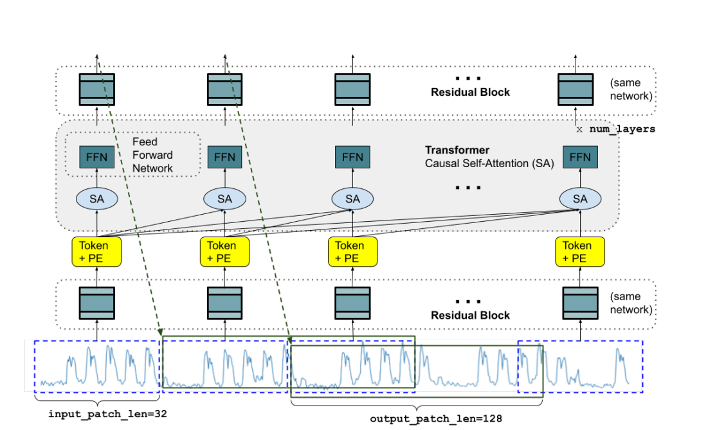
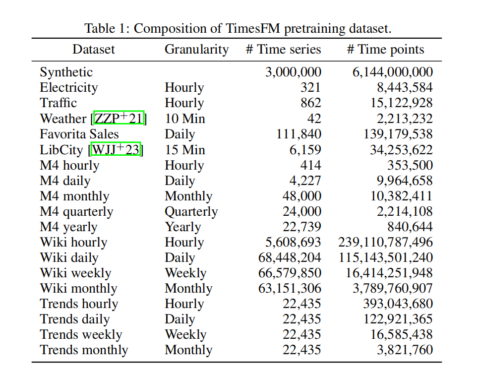
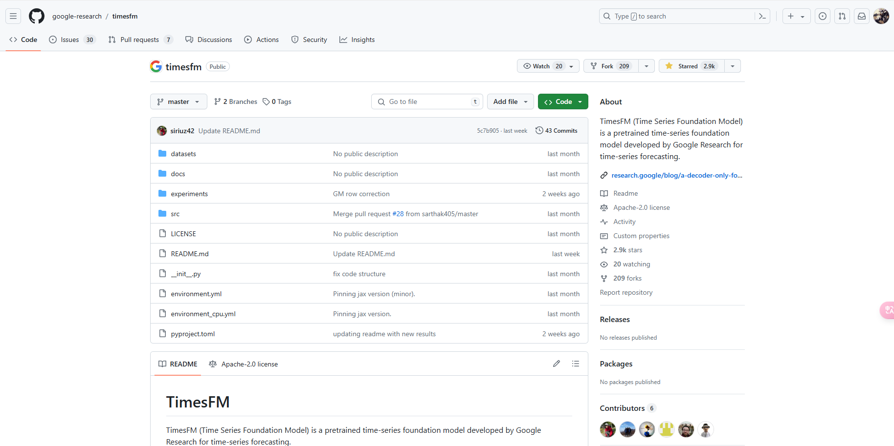

# 自然语言处理:第三十八章: 开箱即用的SOTA时间序列大模型 -Timsfm

文章链接:[[2310.10688] A decoder-only foundation model for time-series forecasting (arxiv.org)](https://arxiv.org/abs/2310.10688)

项目链接: [google-research/timesfm: TimesFM (Time Series Foundation Model) is a pretrained time-series foundation model developed by Google Research for time-series forecasting. (github.com)](https://github.com/google-research/timesfm)

<br />

<br />

## 摘要

本文介绍了由谷歌研究团队成员共同设计的一种专为时间序列预测设计的解码器**通用大基础模型**。该模型通过预训练一个采用输入分块技术的解码器风格注意力模型，并结合输入补全（input patching）技术，在包含真实世界和合成数据的大量时间序列语料上实现。其零样本（zero-shot）性能在多种公开数据集上接近于针对每个数据集的最先进监督预测模型的准确性。研究显示，这一模型能够跨越不同领域、预测时段及时间粒度，生成精确的零样本预测。

<br />

<br />

## 背景介绍

时间序列数据在零售、金融、制造业、医疗健康和自然科学等多个领域中都扮演着至关重要的角色。在这些领域中，时间序列预测是一项核心任务，对于零售供应链优化、能源和交通预测以及天气预报等科学和工业应用都至关重要。传统的预测方法，如ARIMA或GARCH等统计模型，虽然有其优点，但在处理复杂、多变的时间序列数据时往往力不从心。近年来，深度学习模型，尤其是循环神经网络（RNN）、长短时记忆网络（LSTM）和Transformer等模型，在时间序列预测领域取得了显著的成功，并在多个预测竞赛中表现出色。

然而，这些深度学习模型通常需要大量的有监督数据进行训练，并且在面对新的、未见过的数据集时，其泛化能力往往受到限制。因此，开发一种能够在不同领域、不同预测范围和时间粒度上产生准确预测，并且无需大量有监督数据的模型，具有重要的理论意义和实际应用价值。

<br />

<br />

## 核心算法




TimesFM模型是一种解码器仅基础模型（decoder-only foundation model），它采用了输入分块（input patching）技术，并通过大规模时序语料库进行预训练。该模型的特点包括：

1. **解码器风格注意力模型**：

   - TimesFM采用了一种解码器风格的注意力机制，这意味着它专注于预测序列中的下一个时间点，而不是像编码器-解码器模型那样同时处理整个序列。
   - 这种设计允许模型在给定输入序列后并行生成预测，提高了预测效率。
2. **输入分块（Input Patching）**：

   - 借鉴了长期预测工作中的分块技术，TimesFM将时间序列分解为固定大小的块（patches），类似于语言模型中的词元（tokens）。
   - 分块不仅有助于提高训练和推理速度，而且可以通过减少输入序列的长度来提高模型的泛化能力。
3. **长输出分块**：

   - TimesFM允许输出分块的长度大于输入分块的长度，这意味着模型可以一次性预测更多的未来时间点，而不需要逐步自回归生成。
   - 这种设计在长序列预测中特别有效，因为它减少了生成预测所需的步骤数。
4. **分块掩码（Patch Masking）**：

   - 为了确保模型能够处理不同长度的上下文，TimesFM在训练时使用了一种随机掩码策略。
   - 这种方法通过在数据批次中掩码掉部分块或整个块，使得模型能够学习到从1到最大上下文长度的所有可能的上下文长度。
5. **大规模时序语料库**：

   - TimesFM的预训练基于一个包含大量时间序列数据的语料库，这些数据既包括真实世界的数据，如Google Trends和Wiki Pageview统计，也包括合成数据。
   - 这种大规模和多样化的数据源为模型提供了丰富的学习材料，有助于捕捉各种时序模式。

<br />


<br />


其核心思想是将时间序列预测问题转化为一种类似于自然语言处理中的序列生成问题。具体来说，该模型采用了一种解码器风格的注意力机制，通过自注意力（self-attention）和跨注意力（cross-attention）来捕捉时间序列数据中的长期依赖关系和复杂模式。


此外，该模型还使用了大量的时间序列数据进行预训练。这些数据集既包括现实世界中的数据集（如股票价格、销售数据等），也包括合成数据集（如通过模拟生成的数据集）。通过在这些数据集上进行预训练，模型能够学习到各种时间序列数据的共同特征和规律，从而进一步提高其预测性能。




为了增强模型的泛化能力和适应性，研究人员在训练过程中采用了mask技术。具体来说，他们在每个时间步（time step）中随机地隐藏一部分输入数据，然后要求模型根据剩余的输入数据来预测被隐藏的部分。通过这种方式，模型被迫学习从有限的、不完整的信息中生成准确的预测，从而提高了其在新数据集上的泛化能力。

## 实验结果与结论


作者再一个ETT风电数据上做了一个验证，取了不同的horizon水平，也对比很多横向当时不错的模型(上面的index越小越好)可以看到这里的timesFM 可以达到SOTA 0.36的性能。并且它还支持在咱们自己的数据上通用。

<br />


## 使用说明

这个模型截至到笔者写这一篇文章已经2.9K的star了。



### 安装

Google推荐至少16GB RAM 来使用TimesFM。

首先需要把repo下载到工作目录下: 

`git clone https://github.com/google-research/timesfm.git`

如果你是GPU用户:

`conda env create --file=environment.yml`

如果你是CPU用户，

`conda env create --file=environment_cpu.yml`

然后在运行

`conda activate tfm_env `

`pip install -e .`


<br />


<br />


### 加载模型

可以用下面代码初始化模型

```
import timesfm

tfm = timesfm.TimesFm(
    context_len=<context>,
    horizon_len=<horizon>,
    input_patch_len=32,
    output_patch_len=128,
    num_layers=20,
    model_dims=1280,
    backend=<backend>,
)
tfm.load_from_checkpoint(repo_id="google/timesfm-1.0-200m")
```

其中重要的四个参数:

```
input_patch_len=32,
output_patch_len=128,
num_layers=20,
model_dims=1280,
```

* context_len: 这里的 `context_len`可以被设置为模型的最大上下文长度。它必须是 `input_patch_len`的倍数，也就是32的倍数。你可以向 `tfm.forecast()`函数提供一个较短的序列，模型会对其进行处理。目前，模型处理的最大上下文长度为512，但在后续版本中这个长度可能会增加。输入时间序列可以有任何上下文长度。如果需要，填充/截断将由推理代码处理。
* backend: cpu/gpu/tpu
* horizon_len:  对于你的任务来说越大越好，通常不大于context length

<br />


<br />


<br />


### 推理

可以从API的array 或者是支持 `pandas` 的dataframe 类进行推理，详情可以参考 `tfm.forecast()` 和 `tfm.forecast_on_df()`的说明文档

下面举一个官网给的简单的例子:

```
import numpy as np
forecast_input = [
    np.sin(np.linspace(0, 20, 100)),
    np.sin(np.linspace(0, 20, 200)),
    np.sin(np.linspace(0, 20, 400)),
]
frequency_input = [0, 1, 2]

point_forecast, experimental_quantile_forecast = tfm.forecast(
    forecast_input,
    freq=frequency_input,
)
```


`pandas` dataframe，频率设置为每月“M”。

```
import pandas as pd

# e.g. input_df is
#       unique_id  ds          y
# 0     T1         1975-12-31  697458.0
# 1     T1         1976-01-31  1187650.0
# 2     T1         1976-02-29  1069690.0
# 3     T1         1976-03-31  1078430.0
# 4     T1         1976-04-30  1059910.0
# ...   ...        ...         ...
# 8175  T99        1986-01-31  602.0
# 8176  T99        1986-02-28  684.0
# 8177  T99        1986-03-31  818.0
# 8178  T99        1986-04-30  836.0
# 8179  T99        1986-05-31  878.0

forecast_df = tfm.forecast_on_df(
    inputs=input_df,
    freq="M",  # monthly
    value_name="y",
    num_jobs=-1,
)```
```


## 总结与展望

本文介绍了一种基于仅解码器基础模型的时间序列预测方法，该方法通过预训练一个解码器风格的注意力模型，并结合输入补全技术，能够在不同领域、不同预测范围和时间粒度上产生准确的零次学习预测。实验结果表明，该模型在多个未见过的预测数据集上都表现出了优秀的性能，其性能接近甚至达到了最先进的有监督预测模型的准确度。

该模型的成功不仅证明了深度学习在时间序列预测领域的巨大潜力，也为未来的时间序列预测研究提供了新的思路和方法。具体来说，未来的研究可以进一步探索如何将该模型与其他技术（如强化学习、生成对抗网络等）相结合，以进一步提高其预测性能和泛化能力。同时，也可以将该模型应用于更多的实际场景中，如金融风险管理、气候预测和公共卫生监测等，以发挥其在实际应用中的价值。

对于AI领域的资深从业人员来说，本文的研究成果也提供了一些有益的启示。首先，该模型的成功证明了深度学习在解决复杂、多变问题时的优越性。因此，在未来的研究中，可以更多地关注深度学习技术在其他领域的应用。其次，该模型的仅解码器结构和输入补全技术也为其他领域的研究提供了新的范式。
