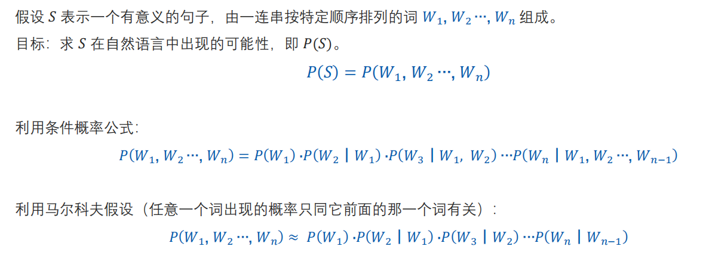
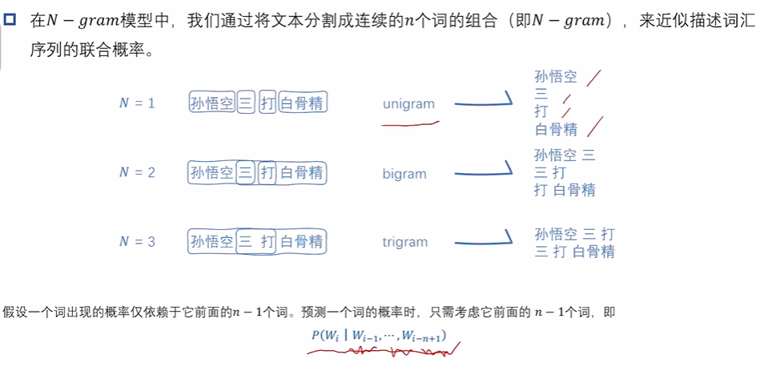

# 自然语言处理: 第一章N-Gram


<br />


<br />


## 一. 理论


**定义:** 语言模型在wiki的定义是**统计式的语言模型**是一个[几率分布](https://zh.wikipedia.org/wiki/%E6%A9%9F%E7%8E%87%E5%88%86%E4%BD%88 "几率分布")，给定一个长度为 m 的字词所组成的字串 W1 , W2 ，··· ，Wn ，派几率的字符串P(S) = P(W1 , W2 ,··· ，Wn ， )而其中由条件概率公式我们可以得到下图2的公式，然后我们再利用马尔可夫假设(每个词的出现的概率只与前面那个词有关)  得到下面的公式3




<br />


<br />


而N-gram的意思，就是每个词出现的概率只取决于前面n - 1个单词的，其中单词的概念可以是词组也可以是字，比如下图中的孙悟空这种单独拆开词无意义的可以看作一个单词。举个例子比如说是2-gram, 我们看到孙悟空这个词需要去预测下一个单词是三，我们看到三需要预测下一个单词是打。所以这种模型的输出完全取决于语料库的概念



优缺点:

* 优点
  * 计算简单
* 缺点
  * 无法捕捉长距离的词汇关系
  * 完全取决于语料库的丰富程度
  * 没有考虑词之间的相似度


<br />


<br />


<br />


## 代码实现

1. 构建自己的语料库，下面定义了一个函数从txt的文件里读取语料并且去掉换行符

   ```
   def read_corpus_file(file):
       with open(file, 'r' , encoding= 'utf-8') as f:
           corpus = f.readlines()
       return [line.strip() for line in corpus]
   ```
2. 定义分词函数
5. 计算ngram词频 ， 根据输入的n 在语料库中计算词频，其中前 n - 1长度的单词是输入， 第n个单词是输出， 语料库中每出现一个则计数器+1

   ```
   # 定义计算N-Gram词频的函数
   def count_ngrams(corpus, n):
       ngrams_count = defaultdict(Counter)  # 创建一个字典存储N-Gram计数
       for text in corpus:  # 遍历语料库中的每个文本
           tokens = tokenize(text)  # 对文本进行分词
           for i in range(len(tokens) - n + 1):  # 遍历分词结果生成N-Gram
               ngram = tuple(tokens[i:i+n])  # 创建一个N-Gram元组
               prefix = ngram[:-1]  # 获取N-Gram的前缀
               token = ngram[-1]  # 获取N-Gram的目标单字
               ngrams_count[prefix][token] += 1  # 更新N-Gram计数

       # 输出信息
       print(f"{n}gram词频:") # 打印Bigram词频
       for prefix, counts in ngrams_count.items():
           print("{}: {}".format("".join(prefix), dict(counts)))
       print('-'*100)
       return ngrams_count
   ```
6. 根据词频计算概率， 根据上面的词频去计算每个prefix 生成中心词的概率

   ```
   # 定义计算Bigram概率的函数
   def ngram_probabilities(ngram_counts):
       ngram_probs = defaultdict(Counter)  # 创建一个字典存储Bigram概率
       for prefix, tokens_count in ngram_counts.items():  # 遍历Bigram计数
           total_count = sum(tokens_count.values())  # 计算当前前缀的总计数
           for token, count in tokens_count.items():  # 遍历每个Bigram计数
               ngram_probs[prefix][token] = \
                   count / total_count  # 计算每个Bigram概率

       print("gram概率:") # 打印Bigram概率
       for prefix, probs in ngram_probs.items():
           print("{}: {}".format("".join(prefix), dict(probs)))
       print('-'*100)
       return ngram_probs
   ```
7. 定义生成下一个词的函数，如果前缀不在语料库中则返回None，如果在的话取几率最大的作为输出

   ```
   # 定义生成下一个词的函数
   def generate_next_token(prefix, bigram_probs):
       if not prefix in bigram_probs:  # 如果前缀不在Bigram概率中，返回None
           return None
       next_token_probs = bigram_probs[prefix]  # 获取当前前缀对应的下一个词的概率
       next_token = max(next_token_probs, 
                        key=next_token_probs.get)  # 选择概率最大的词作为下一个词

       return next_token
   ```
8. 生成连续文本， 这里需要根据n 和随机输入一个prefix 从而得到不间断的生成新的文本，由于可能生成的长度很长，这里通过设置length进行截断

   ```
   def generate_text(prefix, tigram_probs, length=8 , n = 2): 
       '''n : gram'''
       tokens = list(prefix)  # 将前缀转换为字符列表
       for _ in range(length - len(prefix)):  # 根据指定长度生成文本 
           # 获取当前前缀对应的下一个词
           next_token = generate_next_token(tuple(tokens[-1 * (n - 1) : ]), tigram_probs) 
           if not next_token: # 如果下一个词为None，跳出循环
               break
           tokens.append(next_token) # 将下一个词添加到生成的文本中
       return "".join(tokens) # 将字符列表连接成字符串
   ```

<br />


<br />


<br />


最后生成的结果如下：


