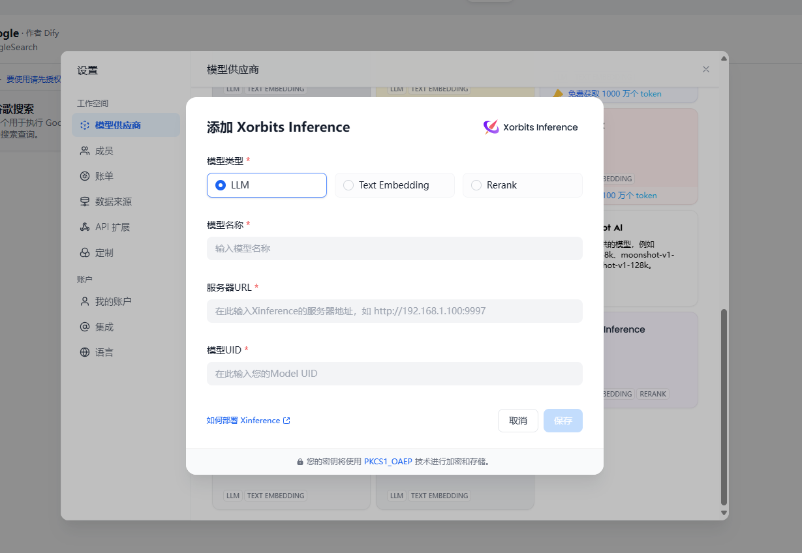

# 自然语言处理: 第十四章Xinference本地部署

项目地址: [Xorbitsai/inference](https://github.com/xorbitsai/inference)

## 理论基础

正如同Xorbits Inference（Xinference）官网介绍是一个性能强大且功能全面的分布式推理框架。可用于大语言模型（LLM），语音识别模型，多模态模型等各种模型的推理。通过 Xorbits Inference，你可以轻松地一键部署你自己的模型或内置的前沿开源模型。无论你是研究者，开发者，或是数据科学家，都可以通过 Xorbits Inference 与最前沿的 AI 模型，发掘更多可能。

介绍这个项目主要是为了后面在dify能够快速部署接入API。



下图是xinference的与其他开源集成大模型框架的对比，可以看到xinference相比于其他开源框架还是有很多有点的。而且本人使用下来发现确实上手简单，


<br />

<br />

## 本地搭建

本人使用的是autodl上，所以相对应的无论是在linxu还是windows系统都差不多

### 1 安装

安装的时候由于xinference直接安装的时候会装pytorch的cpu版本，所以装完之后还需要重新装一下GPU版本的torch

```
# 新建环境
conda create -n xinference python=3.10

# 激活环境
conda activate xinference

# 安装xinference所有包
pip3 install "xinference[all]"

# 安装GOU版的torch
pip3 install torch==2.0.0+cu118 torchvision==0.15.1+cu118 -f https://download.pytorch.org/whl/torch_stable.html --trusted-host=pypi.python.org --trusted-host=pypi.org --trusted-host=files.pythonhosted.org
```

<br />

<br />

### 2. 启动xinference 服务

-host 如果不指定0.0.0.0 就只能本地访问了， -port 指定接口，默认是9997， 我是在autodl上使用的所以必须是6006

`$ xinference-local --host 0.0.0.0 --port 6006`

输入后，正常启动的话输出应该如下

```
2024-02-27 17:17:29,313 xinference.core.supervisor 1504 INFO     Xinference supervisor 0.0.0.0:14154 started
2024-02-27 17:17:29,433 xinference.core.worker 1504 INFO     Starting metrics export server at 0.0.0.0:None
2024-02-27 17:17:29,437 xinference.core.worker 1504 INFO     Checking metrics export server...
2024-02-27 17:17:33,903 xinference.core.worker 1504 INFO     Metrics server is started at: http://0.0.0.0:34531
2024-02-27 17:17:33,905 xinference.core.worker 1504 INFO     Xinference worker 0.0.0.0:14154 started
2024-02-27 17:17:33,906 xinference.core.worker 1504 INFO     Purge cache directory: /root/.xinference/cache
2024-02-27 17:17:33,910 xinference.core.utils 1504 INFO     Remove empty directory: /root/.xinference/cache/bge-reranker-large
2024-02-27 17:17:42,827 xinference.api.restful_api 1496 INFO     Starting Xinference at endpoint: http://0.0.0.0:6006
```

<br />

<br />

### 3. 启动大模型

xinference 提供了两种部署模型的方式

1. 从http://127.0.0.1:<端口>启动交互，在web交互界面中启动服务
2. 命令端启动 ， 至于选择哪种方式看个人。这里由于交互界面比较简单，主要还是介绍下终端的方式


上面如果修改了端口，可以根据下面对应的修改端口

```
# https://hf-mirror.com/ 
export HF_ENDPOINT=https://hf-mirror.com
export XINFERENCE_MODEL_SRC=modelscope
# log缓存地址
export XINFERENCE_HOME=/root/autodl-tmp
# 端口修改了重新设置环境变量
export XINFERENCE_ENDPOINT=http://127.0.0.1:6006
```

<br />

修改完了就可以对应的启动相对应的服务，下面是分别启动chat / embedding / rerank 三种模型的cmd命令, 其他模型命令可以参考xinference主页。 启动完了，会返回对应模型的UID(后期在Dify部署会用到)

```
# 部署chatglm3
xinference launch --model-name chatglm3 --size-in-billions 6 --model-format pytorch --quantization 8-bit
# 部署 bge-large-zh embedding
xinference launch --model-name bge-large-zh --model-type embedding
# 部署 bge-reranker-large rerank
xinference launch --model-name bge-reranker-large --model-type rerank
  
```

如果想测试模型是否已经部署到本地，以rerank模型为例可以执行下面这个脚本， 或者执行

```
from xinference.client import Client

# url 可以是local的端口 也可以是外接的端口
url = "http://172.19.0.1:6006"
print(url)

client = Client(url)
model_uid = client.launch_model(model_name="bge-reranker-base", model_type="rerank")
model = client.get_model(model_uid)

query = "A man is eating pasta."
corpus = [
    "A man is eating food.",
    "A man is eating a piece of bread.",
    "The girl is carrying a baby.",
    "A man is riding a horse.",
    "A woman is playing violin."
]
print(model.rerank(corpus, query))

```

或者执行查看已经部署好的模型

```
xinferencelist
```

如果需要释放资源

```
xinferenceterminate--model-uid"my-llama-2"
```

最后如果需要外网访问，需要查找本地IP地址 即 http://<Machine_IP>:<端口port> , 查找IP地址的方式如下。

```
# Windows
ipconfig/all

# Linux
hostname -I
```
